# F5 Volterra Reference Architecture: DNS Service

<!--
## Contents
- [Customer Success Outcomes](#success-outcomes)
- [Solution Components](#solution-components)
- [Next Steps](#next-steps)
-->

<!--
## Background and Overview
-->

## Use Case: DNS Service
This reference architecture is for customers who need to utilize core DNS and GSLB features within F5XC.

In this scenario, the customer can create publicly hosted, primary and secondary DNS servers.

 

## Customer Success Outcomes
Implementing the prescribed steps as outlined will allow the customer to achieve the following objectives / outcomes:

+ Create Primary DNS Zone in F5 Distributed Cloud via GUI
+ Create Secondary DNS Zone in F5 Distributed Cloud via GUI
+ Create Primary DNS Zone in F5 Distributed Cloud via API

 

<!--
## Architecture
*[TODO: Example network architecture diagram]*

 
-->

## Solution Components
 ## SKU List
 + F5-V-O-ALL-BASE-PKG: Distributed Cloud Services Base Package (/mth) Org
    * DNS Zones: 250 Included Base Package (Additional - $2/Zone)
    * DNS Records: Unlimited (in Org Plan)

 ## Free/Paid-Trial Tiers
 + Individual Tier - $25/month
 + Teams Tier - $200/month
 + Pricing Details - https://www.f5.com/cloud/pricing 

 

## Considerations and Recommendations
For Existing F5 XC Customers - Use customer's Cloud Console to create Primary and Secondary DNS Zones
For prospects - Request PoV tenant by creating a Salesforce Opp 
	
 

<!--
## Scalability
*[TODO: Any scalability considerations or information the customer should be aware of or would help them be successful]*

 
-->

## Prerequisites

+ Access to F5 Distributed Cloud Console (PoC/PoV Tenant or Org plan)
+ Proposed DNS Zone to be created on F5 Distributed Cloud
 

## Configuration - Primary DNS
 

### 1. Navigate to F5XC Portal
Login as NetOps, DevOps, or SecOps user role; select 'DNS Management' from Common services.

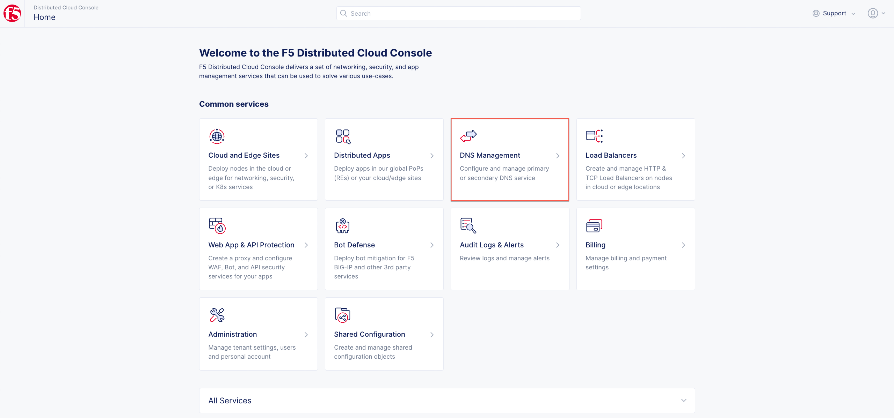

 

### 2. Create Primary DNS
Perform the following steps to create primary DNS:

Configuration steps:
1. Navigate to `DNS Management`.
2. Select `Domain Management`.
3. Click `Add DNS Zone`.

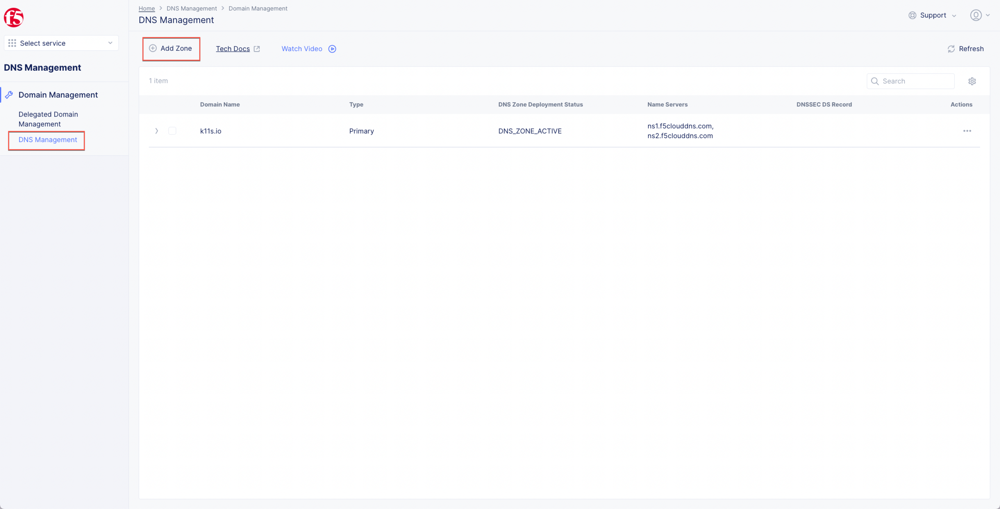

4. Enter a name for `Domain Name`.
5. Select `Primary DNS Configuration` as `Zone Type`.
6. Click `Configure`.

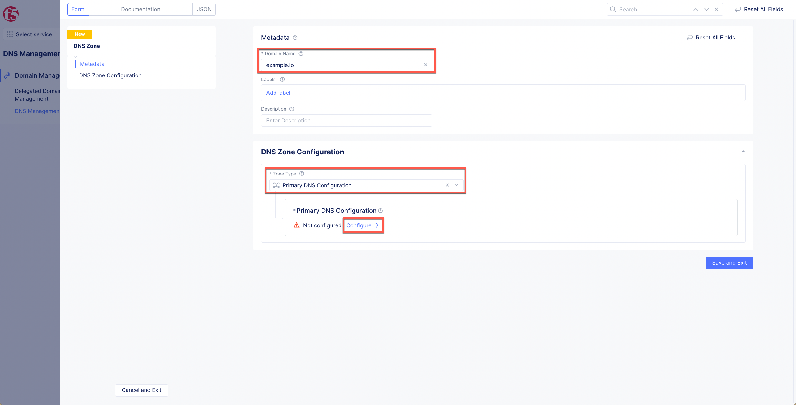

7. Click `Add Item` to create resource records, for example, A, AAAA, CNAME, ALIAS etc.

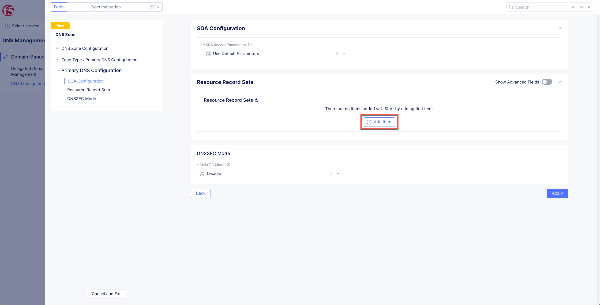

8. Enter the value and click `Apply` to save the configuration.

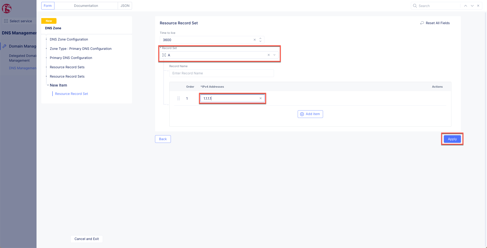

   Optional configuration steps for RR Set Group:
   1. This step configures specific groups for resource record sets. A resource record sets group allows grouping of DNS records to make it easier to manage them. For example, you can group DNS records that belong to the same application.
   2. Expand `Show Advanced Fields` option.
   3. Click `Add Item`, enter name of RR group name.

   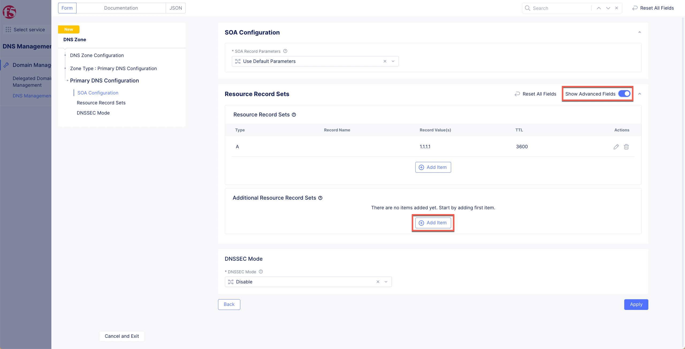

   4. Enter a `Domain Name` in the Metadata section.
   5. Click `Add Item` in the `Resource Record Sets` section.

   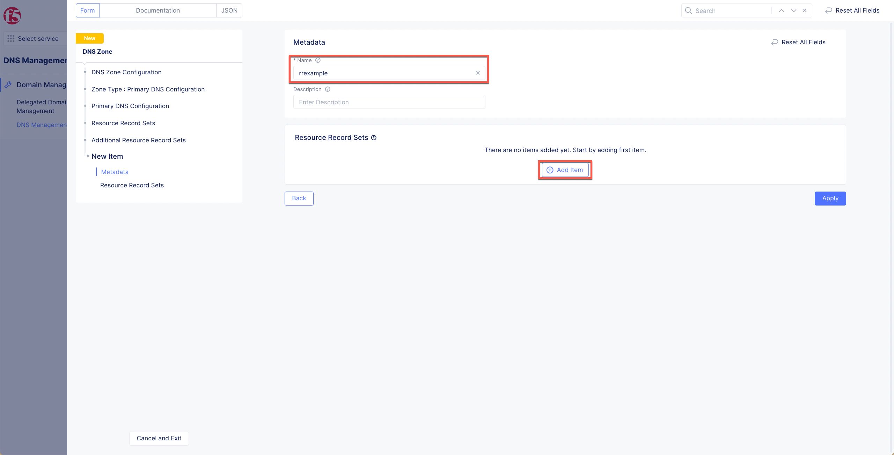

   6. Select a record type under the `Record Set` drop down menu, and set the fields as per your record type selection. Click `Apply` to save the configuration.

   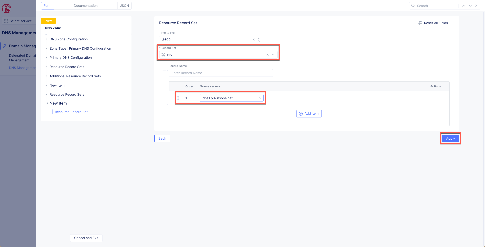

9. Click `Save and Exit` to finish creating primary DNS.

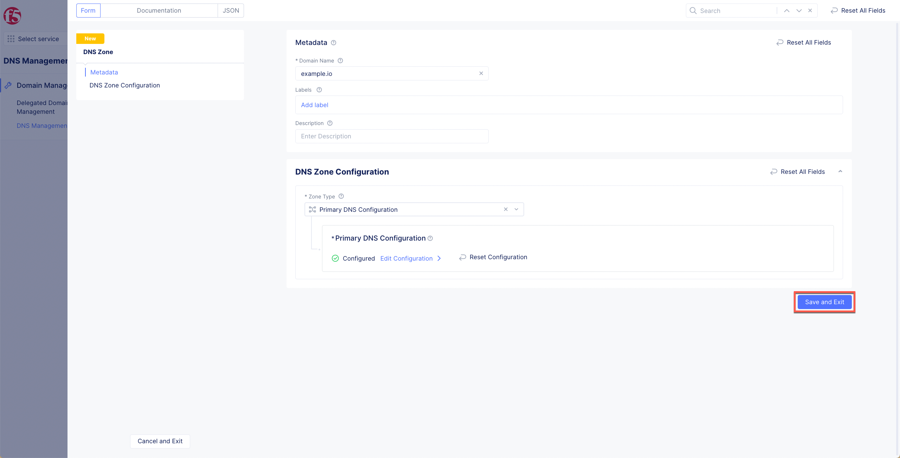

 

### 3. Verify Primary DNS

1. Verify `Primary` is listed under `Type` column.
1. Verify `DNS Zone Deployment Status` as `DNS_ZONE_ACTIVE`, after few seconds later adding the Primary Zone.
1. Name servers listed under `Name Servers`, this NS information is needed in next step, to add it in customer's TLD or Sub-domain.

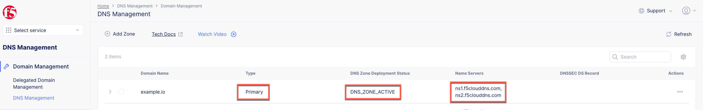

 

### 4. Add F5XC Name Servers to TLD/Sub-domain

Customers need to add F5XC name servers to their respective TLD or Sub-domain, delegate the queries to F5XC, and host the domain  publicly on the Internet.

Verify the configured RRs are resolving correctly for the sub-domain.

 

## Configuration - Secondary DNS
 

### 1. Navigate to F5XC Portal
Login as NetOps, DevOps, or SecOps user role; select `DNS Management` from Common services.

 

### 2. Create Secondary DNS
Perform the following steps to create primary DNS:

Configuration steps:
1. Navigate to `DNS Management`.
2. Select `Domain Management`.
3. Click `Add Zone`.

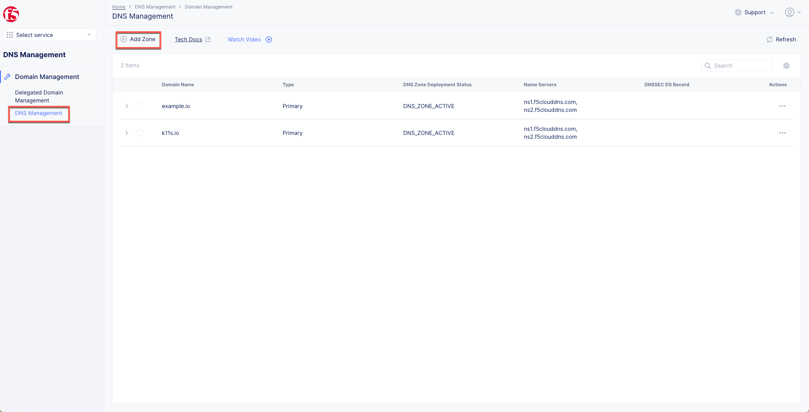

4. Click `Add Zone`.
5. Enter a name for `Domain Name`.
6. Select `Secondary DNS Configuration` as `Zone Type`.

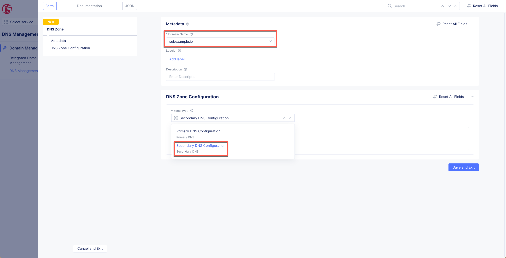

7. Click `Configure`.

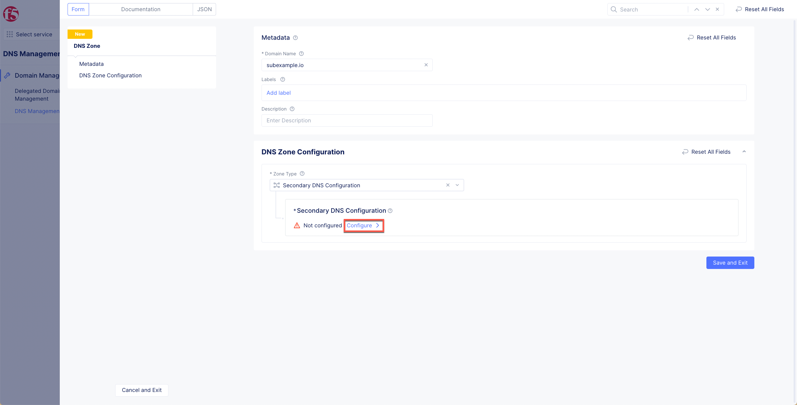

8. Enter `DNS primary server IP` in the `Zone Configuration` section.
9. Enter the Transaction Signature (TSIG) key name in the TSIG key name as used in TSIG protocol extension field.
10. Click on the TSIG Key algorithm field and select an algorithm from the drop-down. Ensure that the key value for the key specified is compatible with the algorithm being selected.
`Note: Configuring TSIG key and algorithm is optional.`
11. Encrypt your secret. Paste your secret in the `Secret Info` section, ensure that the `Type` is `Text`, and click `Blindfold`.
12. Wait for the encryption to complete and click `Apply`.

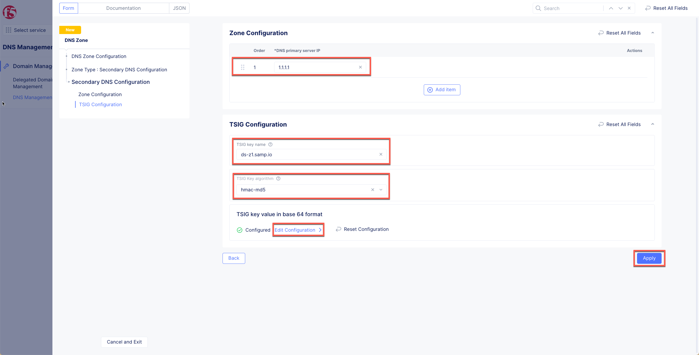

13. Click `Apply` and `Save and Exit`.

 

### 3. Verify Secondary DNS
Perform the following steps to verfiy secondary DNS setup:
1. Verify `Secondary` is listed under `Type` column.
1. Verify `DNS Zone Deployment Status` as `DNS_ZONE_ACTIVE`, after few seconds later adding the Secondary Zone.
1. Edit the configuration, to see last successful AXFR timestamp, and zone file with RRs. 
1. Name servers listed under `Name Servers`, this NS information is needed in next step, to add it in customer's TLD or Sub-domain.

 

### 4. Add F5XC Name Servers to TLD/Sub-domain

Customers need to add F5XC name servers to their respective TLD or Sub-domain, delegate the queries to F5XC NSs along with their primary name servers.

Verify the configured RRs are resolving correctly from F5XC name server.

 

<!--
## Validation
*[TODO: How the customer can verify that it is all working]*

 
-->

<!--
## Resources
*[TODO: A list of any relevant or useful resources that would help the customer to understand the proposed solution or to make the most of their investment]*
* *[(optional) A simulator scenario on [the simulator site](https://simulator.f5.com/)]*
* *[(optional) A lightboard session or guide on [DevCentral](https://devcentral.f5.com/)]*
* *[(optional) An overview video on the [F5 Youtube Channel](https://www.youtube.com/user/f5networksinc)]*

 
-->

<!--
## FAQ / Support
* *[TODO: Things to check if there are issues, or how to engage F5 for support.]*
* *[TODO: How to engage Professional Services]*

 
-->

<!--
## Next Steps
* *[TODO: How to buy or engage Sales]*
* *[TODO: Link(s) to discussion or community group on DevCentral]*
* *[TODO: Adjacent F5 content that may be useful or pertinent.]*

 
-->