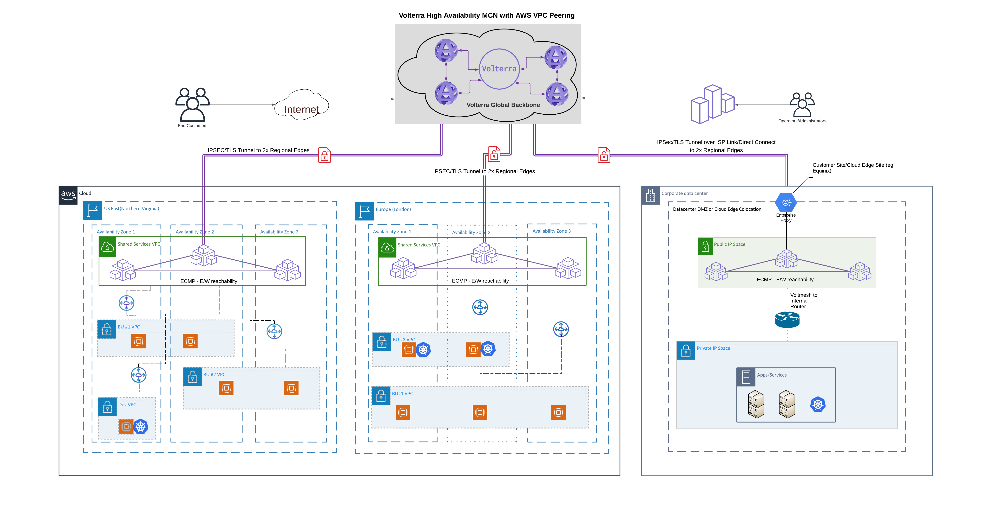

# F5 Volterra Reference Architecture: MCN with AWS VPC Peering

<!--
## Contents
- [Customer Success Outcomes](#success-outcomes)
- [Solution Components](#solution-components)
- [Next Steps](#next-steps)
-->

<!--
## Background and Overview
-->

## Use Case: MCN with Amazon Web Services (AWS) Virtual Private Cloud (VPC) Peering
This reference architecture is for the customer who has their applications running in multiple VPCs across different Availability Zones and Regions.


In this scenario, the customer can utilize F5 Distributed Cloud as a workaround for native [AWS VPC peering limitations](https://docs.aws.amazon.com/vpc/latest/peering/invalid-peering-configurations.html).

<br>

## Architecture


<br>

## Solution Components
+ F5® Distributed Cloud Console
+ F5® Distributed Cloud Mesh Node(s)
+ F5 global network

 # SKU List:
 + F5-V-O-ALL-BASE-PKG: Distributed Cloud Services Base Package (/mth) Org
 + F5-V-O-MCE-MSH-ND4C: Distributed Cloud Mesh Small Node (upto 4 VCPU, /mth) MCE Org
 + F5-V-O-MCE-MST-T2ADN: Distributed Cloud App Stack Traffic Generated by Node to ADN per TB (/mth) MCE Org

 * Optional SKUs:
 + F5-V-O-MCE-MSH-ND8C​ - Distributed Cloud Mesh Medium Node (Upto 8 VCPU, /mth) MCE Org
 + F5-V-O-MCE-MSH-ND16C​ - Distributed Cloud Mesh Medium Node (Upto 16 VCPU, /mth) MCE Org
 + F5-V-O-MCE-MSH-NC4C​ - Distributed Cloud Mesh 3-Node Cluster Small (upto 4 VCPU, per month) MCE Org​
 + F5-V-O-MCE-MSH-NC8C​ - Distributed Cloud Mesh 3-Node Cluster Medium (upto 8 VCPU, per month) MCE Org​
 + F5-V-O-MCE-MSH-NC16C​ - Distributed Cloud Mesh 3-Node Cluster Large (upto 16 VCPU, per month) MCE Org​


<br>

### Prerequisites
This guide assumes the following prerequisites:
+ That you have an existing [F5® Distributed Cloud Account](https://console.ves.volterra.io/) and access to the online portal. In case you do not have an account, see [Create an Account](https://docs.cloud.f5.com/docs/quick-start/on-board).

+ AWS account with credentials, tenant definitions and certificates already created.

Note: Refer to the required permissions to create cloud resources in the [Cloud Credentials Reference](https://docs.cloud.f5.com/docs/reference/cloud-cred-ref) guides. These guides also provide instructions to create the roles and associated service accounts using the cloud formation templates.

<br>

## Deployment - F5® Distributed Cloud

<br>

### 1. Add Cloud Credentials
Perform the following steps to start creating cloud credentials object:

Configuration steps:
1. Navigate to the Cloud Credentials page.
    1. Select the `Cloud and Edge Sites` service.
    1. Navigate to `Manage` -> `Site Management` -> `Cloud Credentials.`
1. Start creating cloud credentials.
    1. Click `Add Cloud Credentials`.
    1. Enter a name for the credential you are creating.
    1. Optionally add labels and a description to this entry.
1. Select cloud credential type.
    1. Select a cloud credential type from the drop-down menu. There are:
        + `AWS Programmatic Access Credentials`
        + `Azure Credential Client Certificate`
        + `Azure Client Secret for Service Principal`
        + `GCP Credentials`

<br>

### 2. Configure Credentials

<br>

**AWS Programmable Access Credentials**

Perform the following steps for AWS programmable access credentials:

```
Note: Temporary security credentials such as credentials generated using AWS STS are not supported.
```

Configuration steps:
1. Obtain your access key ID and secret from AWS.

    Retrieve your access key id and secret you intend to use for accessing AWS API services from your AWS Management Console IAM Dashboard ([AWS IAM Reference](https://docs.aws.amazon.com/iam/index.html)).
1. Set the access key and configure secret.
    1. Select `AWS Programmable Access Credentials` for the `Select Cloud Credential Type` field.
    1. Enter the AWS Access Key ID that you retrieved from your AWS account.
    1. Configure Secret Access Key by clicking on the `Configure` link below where you entered the Access Key ID.
    1. Secret information can be one of two types via drop-down.
        + `Blindfold Secret`: Used for secrets managed by Distributed Cloud Secret Management Service (Recommended as this service provides a high level of security).
        + `Clear Secret`: Used for secrets that are not encrypted.
    1. Policy information can be one of two types via drop-down.
        + `Built-in`: Provides a list of Distributed Cloud Services provided set of generic policies.
        + `Custom`: Provides a list of user defined policies which have been defined under `Manage` -> `Secrets`.
    1. Enter or paste the text or blindfold value of the AWS Secret Key.
    1. For a text secret, click on the `Blindfold` button to generate the blindfold key based on the AWS Secret Key. To see the blindfold result, click `Edit` after the Blindfold process is complete.
    1. Once the key has been generated or entered, click `Apply` and then click `Save and Exit` button to exit the wizard and save your AWS credentials for use with Distributed Cloud Services.

<br>

### 3. Create AWS Site

<br>

This part of the guide provides instructions on how to deploy F5® Distributed Cloud Services sites with AWS using Deploy Using F5® Distributed Cloud Console (Console). For more information on sites, see [Site](https://docs.cloud.f5.com/docs/ves-concepts/site).

```
Note: Configuring site mesh group is not supported for the sites deployed from Console.
```

Using the instructions provided in this guide, you can deploy an ingress/egress gateway site. For more information, see [Network Topology of a Site](https://docs.cloud.f5.com/docs/ves-concepts/site#network-topology-of-a-site).

<br>

**Deploy Using Console**
AWS VPC site object creation and deployment includes the following:

|Phase|Description|
|----|----|
|Create AWS VPC Object|Create the VPC object in Console using the guided wizard.|
|Deploy Site|Deploy the sites configured in the VPC object using automated method.|

<br>

**Create AWS VPC Site Object**
Sites can be viewed and managed in multiple services: `Cloud and Edge Sites`,`Distributed Apps`, and `Load Balancers`.

This example shows `Sites` for AWS setup in `Cloud and Edge Sites`.

Configuration steps:
1. Log into Console, start AWS VPC site object creation.
    1. Open Console and click `Cloud and Edge Sites`.

         ```
         Note: Homepage is role based, and your homepage may look different due to your role customization. Select All Services drop-down menu to discover all options. Customize Settings: Administration > Personal Management > My Account > Edit work domain & skills button > Advanced box > check Work Domain boxes > Save changes button.
         ```

         ```
         Note: Confirm Namespace feature is in correct namespace in upper-left corner. Not available in all services.
         ```

    1. Click `Manage` > `Site Management` > `AWS VPC Sites`.

        ```
        Note: If options are not showing available, select Show link in Advanced nav options visible in bottom left corner. If needed, select Hide to minimize options from Advanced nav options mode.
        ```

    1. Click `Add AWS VPC Site` button.

    1. Enter `Name`, enter `Labels` and `Description` as needed.
1. Configure VPC and site settings.

    In the `Site Type Selection` section, perform the following:
    1. Set region and configure VPC.
        1. Select a region from the `AWS Region` drop-down menu.
        1. From the `VPC` menu, select an option:
            + `New VPC Parameters`: The `Autogenerate VPC Name` option is selected by default.
            + `Existing VPC ID`: Enter existing VPC ID in `Existing VPC ID` box

              ```
              Note: If you are using an existing VPC, enable the enable_dns_hostnames box in the existing VPC configuration.
              ```

        1. Enter the CIDR in the `Primary IPv4 CIDR block` field.
    1. Set the node configuration.

        We will configure two interfaces site for this deployment because the site will be used as ingress and engress gateway to the VPCs. From the `Select Ingress Gateway or Ingress/Engress Gateway` drop down menu, choose `ingress/Egress Gateway (Two Interface)`

        + Configure Ingress/Egress Gateway.

            For the `Ingress/Egress Gateway (Two Interface)` option:
            1. Click `Configure` to open the two-interface node configuration.
            1. Click `Add Item`.
            1. Select an option from the `AWS AZ Name` menu that matches the configured `AWS Region`.
            1. From the `Workload Subnet` menu, select an option:
                + `New Subnet`: Enter a subnet in the `IPv4 Subnet` field.
                + `Existing Subnet ID`: Enter a subnet in the `Existing Subnet ID` field.

                ```
                Note: Workload subnet is the network where your application workloads are hosted. For successful routing toward applications running in workload subnet, an inside static route to the workload subnet CIDR needs to be added on the respective site object.
                ```
                
            1. From the `Subnet for Outside Interface` menu, select an option:
                + `New Subnet`: Enter a subnet in the `IPv4 Subnet` field.
                + `Existing Subnet ID`: Enter a subnet in the `Existing Subnet ID` field.
            1. Click `Add Item`.

            ```
            Note: Enable the Show Advanced Fields option to configure Subnet for Inside Interface.
            ```

            ```
            For this deployment, we will create a cluster which contains three nodes.
            ```

    1. Set the deployment type.
        From the `Select Automatic or Assisted Deployment` drop-down menu, select an option:
        + `Automatic Deployment`: Select the AWS credentials object that was created from the previous step.

            ```
            Note: Ensure that the AWS credentials are applied with required access policies per the Policy Requirements document.
            ```

1. Set the site node parameters.
    1. In the `Site Node Parameters` section, enable the `Show Advanced Fields` option. Optionally, add a geographic address and enter the latitude and longitude values.
    1. From the `AWS Instance Type for Node` menu, select an option.
    1. Enter your SSH key in the `Public SSH key` box.
    1. From the `Desired Worker Nodes Selection` menu, select an option:
        + Enter the number of worker nodes in the `Desired Worker Nodes Per AZ` field. The number of worker nodes you set here will be created per the Availability Zone in which you created nodes. For example, if you configure three nodes in three Availability Zones, and set the `Desired Worker Nodes Per AZ` box as 3, then 3 worker nodes per Availability Zone are created and the total number of worker nodes for this AWS VPC site will be 9.

        ```
        Note: Enable the Show Advanced Fields option to set the worker node count.
        ```

1. Complete the AWS VPC site object creation.
    + Click `Save and Exit` to complete creating the AWS VPC site.
    + The `Status` box for the VPC object displays `Generated`.
    + Click `Apply` to create the site.

<br>

## Deployment - AWS

<br>

### Connect the F5 Cluster with AWS VPCs

<br>

This part of the guide provides instructions on how to connect the AWS VPC site that you just deployed using the Console with other AWS VPCs that are running.

<br>

1. **Create VPC peering connections**

Please refer to AWS documentation on how to [create and accept VPC peering connections](https://docs.aws.amazon.com/vpc/latest/peering/create-vpc-peering-connection.html).

2. **Update the Route Tables**

Please refer to AWS documentation on how to [update your route tables for a VPC peering connection](https://docs.aws.amazon.com/vpc/latest/peering/vpc-peering-routing.html)

<br>

## Deployment - F5® Distributed Cloud

<br>

### 1. Add Origin Pool
The following steps explain the required actions for the process of origin pool creation.

Configuration steps:
1. Navigate to origin pool configuration.
1. Start the origin pool creation process.
1. Configure the origin servers.
1. Optionally, configure health check.
1. Optionally, set TLS configuration.
1. Optionally, set the advanced options.
1. Complete origin pool creation.

<br>

### 2. Add HTTP Load Balancer
Perform the following steps to create a HTTP Load Balancer:

Configuration steps:
1. Navigate to HTTP load balancer configuration.
1. Start load balancer creation process.
1. Optionally, configure routes.
1. Configure VIP advertisement.
1. Optionally, set security configuration.
1. Configure load balancer control and requests.
1. Optionally, set advanced configuration.
1. Complete creating the load balancer.

<br>

<!--

## Validation
*[TODO: How the customer can verify that it is all working]*

<br>


## Resources
*[TODO: A list of any relevant or useful resources that would help the customer to understand the proposed solution or to make the most of their investment]*
* *[(optional) A simulator scenario on [the simulator site](https://simulator.f5.com/)]*
* *[(optional) A lightboard session or guide on [DevCentral](https://devcentral.f5.com/)]*
* *[(optional) An overview video on the [F5 Youtube Channel](https://www.youtube.com/user/f5networksinc)]*

<br>

## FAQ / Support
* *[TODO: Things to check if there are issues, or how to engage F5 for support.]*
* *[TODO: How to engage Professional Services]*

<br>

## Next Steps
* *[TODO: How to buy or engage Sales]*
* *[TODO: Link(s) to discussion or community group on DevCentral]*
* *[TODO: Adjacent F5 content that may be useful or pertinent.]*

<br>
-->

